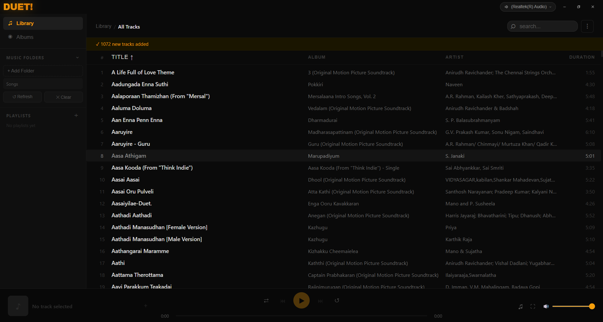
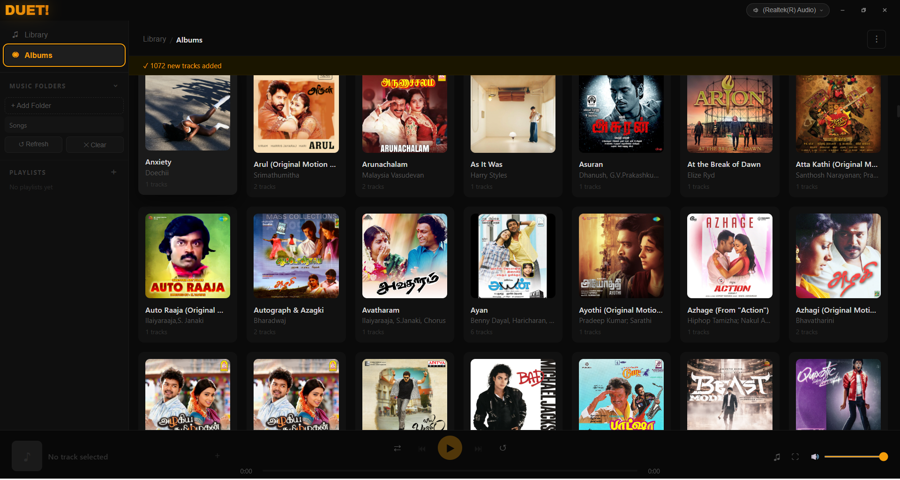
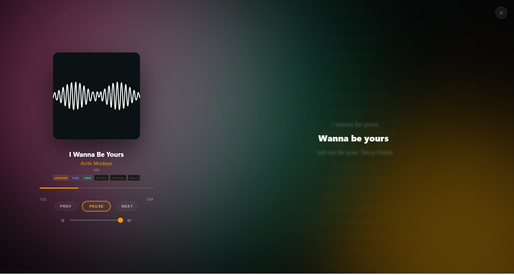

# DUET Music Player
DUET is a high performance, **completely offline** music player built with **Svelte** and **Tauri v2**. It is designed for users who keep their own high-quality music collections and want a fast, native experience on Windows.

### Key Features:
* **100% Offline:** No internet connection required. No accounts, no logins, and no data syncing. Your music stays where it belongs: on your system.
* **High-Fidelity Ready:** Bit perfect playback support for lossless formats like **FLAC and WAV**, plus full support for all standard audio formats.
* **Visual Lyrics View:** A dedicated interface for viewing lyrics while you listen, perfect for following along with your favorite albums.
* **Built for Speed:** Created using a Rust-based backend (Tauri) and a Svelte frontend, ensuring the app opens instantly and uses minimal system resources.

## 📸 Screenshots

  
  
  

